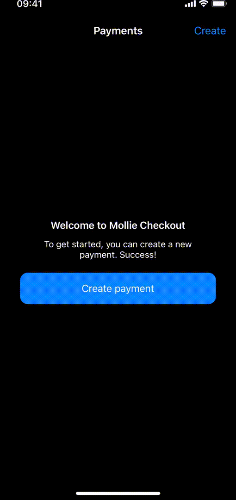

# Flow 2: Advanced implementation

The advanced implementation makes use of a WKWebView to handle the payments in-app.

> **Note:** Make sure to first implement the basic flow ([Flow 1: Basic implementation (recommended)](FLOW_BASIC.md)) before implementing this advanced flow.

## Step 1: Creating the in-app browser ViewController

Instead of launching the payment url in the basic flow, create a UIViewController that contains a WKWebView to load the url in.

## Step 2: Set WKWebView settings

Configure the delegate on the WKWebView:

```swift
private func setupWebView() {
    webView.navigationDelegate = self
}
```

## Step 3: Configure the WKWebView client callback

```swift
extension InAppBrowserViewController: WKNavigationDelegate  {

    func webView(_ webView: WKWebView, decidePolicyFor navigationAction: WKNavigationAction, decisionHandler: @escaping (WKNavigationActionPolicy) -> Void) {
        // Get payment id
        if let url = navigationAction.request.url {
            if url.absoluteString.contains(urlScheme) {
                let paymentId = Int(url.lastPathComponent)
                self.onPaymentFinished()
                decisionHandler(.allow)
            } else if (url.scheme?.lowercased() != "http" && url.scheme?.lowercased() != "https") {
                // It's a deeplink, open it
                UIApplication.shared.open(url, options: [:], completionHandler: nil)
                decisionHandler(.cancel)
            } else {
                decisionHandler(.allow)
            }
        } else {
            decisionHandler(.allow)
        }
    }
}
```

> Note: There are various situations in the in-app browser flow where the user did not return to the app via the deeplink or callbacks.

## Step 4: Reload status in in-app browser ViewController

Make sure to reload the payment status when opening the ViewController to detect whether the payment has been completed:

```swift
override func viewDidLoad() {
    super.viewDidLoad()
    
    NotificationCenter.default.addObserver(self, selector: #selector(applicationWillEnterForeground(_:)), name: UIApplication.willEnterForegroundNotification, object: nil)
    // ...
}

@objc func applicationWillEnterForeground(_ notification: Notification) {
    guard let paymentId = payment?.id else { return }

    // Check if payment status changed and handle accordingly.
    // When the browser opened an external app, the external app will call our deeplink to open the app again. However there are some caveats:
    // 1. When iOS opens a deeplink, it will show an alert to the user. The user may have decided to click cancel here and therefore not opening the deeplink after doing the payment.
    // 2. The payment may be done asynchronously and the user may manually return to the app. In this case this screen is still open while the payment might have already been finished.
    // In conclusion it is a best practice to check the status of the payment when the user returns back to the app to make sure that this payment is not completed already.
    PaymentService.shared.getPayment(paymentId) { [weak self] result in
        switch result {
        case .success(let payment):
            self?.payment = payment
            if payment.status.completed {
                DispatchQueue.main.async { [weak self] in
                    self?.onPaymentFinished()
                }
            }
        case .failure(let error):
            print(error)
        }
    }
}
```

# Additions

After implementing the advanced flow, the following additions are available:

- [Optional: Implement payment methods](IMPLEMENT_PAYMENT_METHODS.md)

# Resources

Related samples in Mollie Checkout:

- [InAppBrowserViewController.swift](Checkout/Scenes/PaymentFlow/InAppBrowser/InAppBrowserViewController.swift): example ViewController with the WKWebView.
