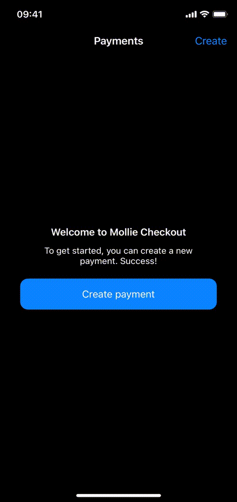
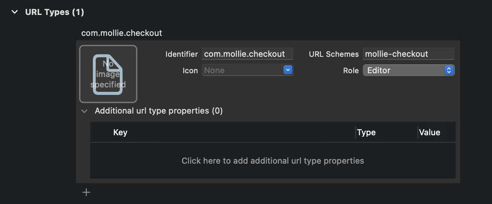

# Flow 1: Basic implementation (recommended)

The basic implementation consists of creating and executing the payment and handling the result when the payment is completed.

The payment url is being opened in an external browser handle the payment process.

## Step 1: Create payment

The bare minimum needed to create a payment is a `description` and the `amount`. Usually these values are determined based on what is being bought.

Create a payment by executing the backend call which creates the payment with these values.

> **Note:** It is required define the `amount` of the payment in a safe environment (the backend). Mollie Checkout uses user input here only for demonstration purposes.

## Step 2: Executing payment

After successfully creating the payment, the resulting payment object contains an `url`. This is the checkout url of the payment which should be opened for the user to execute the payment.

Open the `url` for the user:

```swift
UIApplication.shared.open(paymentUrl)
```

## Step 3: Handling the payment result

Generally the payment result comes back via the deeplink that is configured by the backend when creating the payment.

Deeplinks are url's that have a custom scheme which can take users directly to a specific part of your app. To learn more about deeplinks, check out the [documentation](https://developer.apple.com/documentation/xcode/defining-a-custom-url-scheme-for-your-app).

The demo app uses `mollie-checkout` as deeplink.

Start with defining the URL scheme for the deeplink. Go to _Project Settings_ > _Info_, and inside _URL Types_ add the URL scheme.



Next, in the SceneDelegate handle the incoming deeplink:

```swift
func scene(_ scene: UIScene, openURLContexts URLContexts: Set<UIOpenURLContext>) {
    // Get payment id
    guard
        let urlContext = URLContexts.first,
        let paymentId = Int(urlContext.url.lastPathComponent)
    else { return }
   
    // Refresh the PaymentsViewController's data
    guard
        let navigation = window?.rootViewController as? UINavigationController,
        let paymentsDelegate = navigation.viewControllers.compactMap({ $0 as? PaymentsViewControllerDelegate }).first
    else { return }
    paymentsDelegate.paymentCompleted()
}
```

In the demo app the PaymentsViewController receives a callback via the delegate. Upon receiving the PaymentsViewController closes any presented modal, goes back to the root ViewController, and refreshes the full payments list:

```swift
extension PaymentsViewController: PaymentsViewControllerDelegate {
    
    func paymentCompleted() {
        refreshPayments()
        presentedViewController?.dismiss(animated: true, completion: nil)
        navigationController?.popToRootViewController(animated: true)
    }
}
```

## Step 4: Refresh payment status

It is recommended to refresh the payment(s) when the user returns to the app, because there are some cases where the user can successfully complete the payment while preventing the return via the deeplink.

Refresh the payments when the app enters foreground:

```swift
override func viewDidLoad() {
    super.viewDidLoad()
    
    NotificationCenter.default.addObserver(self, selector: #selector(applicationWillEnterForeground(_:)), name: UIApplication.willEnterForegroundNotification, object: nil)
    // ...
}

@objc func applicationWillEnterForeground(_ notification: Notification) {
    refreshPayments()
}
```

The payment status may have changed while navigating inside the app, so it's good to refresh the payments on `viewWillAppear`.

```swift
override func viewWillAppear(_ animated: Bool) {
    super.viewWillAppear(animated)
    refreshPayments()
}
```

**Note: Using modals**

Since iOS 13 UIViewControllers can also be presented modally, causing them to overlap the current UIViewController which remains visible behind it. 

However, in this case `viewWillAppear()` is not being called when dismissing the modal. A way to overcome this is to implement the `UIAdaptivePresentationControllerDelegate`:

```swift
@IBAction func createTapped(_ sender: Any) {
    guard let navigationVC = R.storyboard.createPayment.instantiateInitialViewController() else { return }
    navigationVC.presentationController?.delegate = self // Set the delegate
    present(navigationVC, animated: true, completion: nil)
}

extension PaymentsViewController: UIAdaptivePresentationControllerDelegate {

    func presentationControllerDidDismiss(_ presentationController: UIPresentationController) {
        refreshPayments()
    }
}
```

Yet, when closing the modal programmatically both the `viewWillAppear()` and `presentationControllerDidDismiss()` are not being called. In the demo app we call this manually when dismissing the modal:
```swift
@IBAction func cancelTapped(_ sender: Any) {
    if let presentingPresentationController = presentingViewController?.presentationController {
        presentingPresentationController.delegate?.presentationControllerDidDismiss?(presentingPresentationController)
    }
    dismiss(animated: true, completion: nil)
}
```

# Additions

After implementing the base flow, the following additions are available:

- [Flow 2: Advanced implementation](FLOW_ADVANCED.md)
- [Optional: Implement payment methods](IMPLEMENT_PAYMENT_METHODS.md)

# Resources

Related samples in Mollie Checkout:

- [PaymentsViewController.swift](Checkout/Scenes/Payments/PaymentsViewController.swift): refreshing payments & handling the return of a completed payment.
- [CreatePaymentViewController.swift](Checkout/Scenes/CreatePayment/CreatePaymentViewController.swift): creation of the payment.

